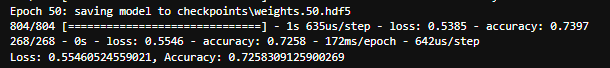
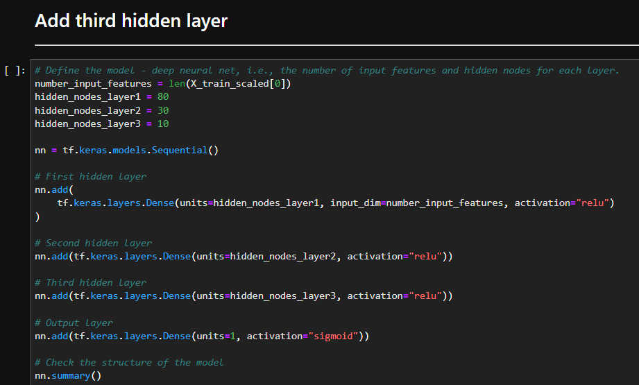
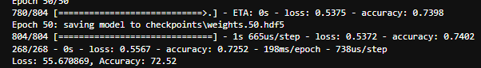
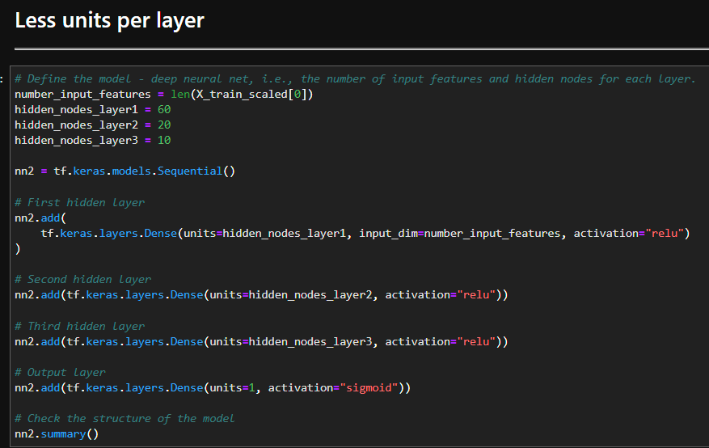
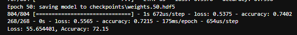
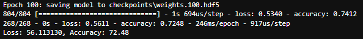
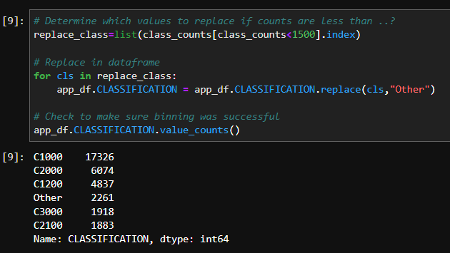
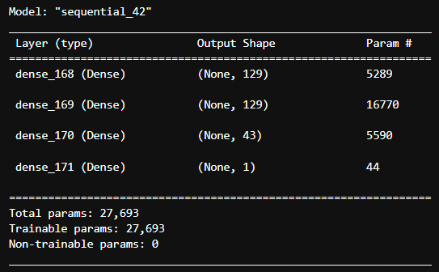
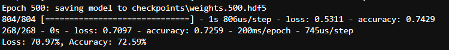

# Neural Network Model - Charity Analysis

## Project Overview

## Results

### Data Preprocessing
- ***Target variables***: The target variable is the `IS_SUCCESSFUL` column, indicating whether or not the money was used effectively.
- ***Features***: The features were all the columns except the target column, and the ID columns (`EIN` and `NAME`)
- ***Removeable variables***: The variables that were removed were the `EIN` and `NAME` columns- since these columns are simply identifiers and do not contribute to whether the money was used effectively.

### Compiling, Training, and Evaluating the Model
#### ***Neurons, layers, and activation functions***
The parameters for the neural network model structure were initially chosen to match the output from the starter code- this seemed like a decent starting point for the model.

- input layer:
    - set to `len(X_train_scaled[0])` to match number of features in the model
- hidden layer 1:
    -  `units` = 80
    - activation = `relu`
- hidden layer 2:
    - `units` = 30
    - activation = `relu`
- output layer:
    - `units` = 1
    - activation = `sigmoid`
- loss = `binary_crossentropy`
- optimizer = `adam`
- epochs = 50

***Was target model performance achieved?*** 
The model accuracy was initially 72.58%, which is just short of the 75% cutoff. This indicated that some optimization would be needed to reach the goal accuracy. 

***First Model Accuracy*** 
 

***Steps taken to optimize model*** 
1. **Adding an extra hidden layer** 
Adding in an extra hidden layer with `units`=10 and activation = `relu` slightly decreased the accuracy down to 72.52%. 

    ***Structure***

      

    ***Accuracy***

      

2. **Third hidden layer added, decrease units/layer** 
Decreasing the number of units per layer decreased the accuracy further down to 72.15%. 

    ***Structure***

      

    ***Accuracy***

      

3. **Third hidden layer added, increase epochs to 100** 
Going back to the same units/layer as in optimization 1 and increasing the epochs to 100 brought the accuracy back up to 72.48%. 

    ***Structure***

      

    ***Accuracy***

      

4. **Change `CLASSIFICATION` threshold, added third hidden layer, increase units/layer, increase epochs** 
This final model increased the accuracy very slightly up to 72.59%, but also increased the loss by almost 20%. 

    ***Change to `CLASSIFICATION` binning threshold*** 
    Since the distribution of data points for the classification column were skewed right, I thought increasing the threshold for binning as 'Other' from 1000 to 1500 to reduce the total number of Classification categories might improve the model's performance.

     

    ***Structure***

      

    ***Accuracy***

      

## Summary

### Overall results
Overall, even with several changes I was only able to improve the accuracy of the the model by 0.01%, but this came at the expense of increasing the loss by almost 20%. It appeared that increasing the complexity of the model hindered its performance.  

Overall, I think the original model was best, but there are potentially other things that could be done to better optimize the model. For instance, binning the `ASK_AMT` column values since they have such a huge variance, or cleaning up the `INCOME_AMT` column, since the bins for that column are spread inconsistently and there's a category labeled 'Jan-99' which seems like an error. 

### Recommendation for how a different model could solve this classification problem
It's  possible a Random Forest Classifier Model could work for this problem. The data is large, but not particularly complex, so a Random Forest Classifier model might be able to get similar results but much quicker and with much fewer optimizations. The neural network model may have overcomplicated the problem, so something simpler like a Random Forest could be a better fit for the data. 