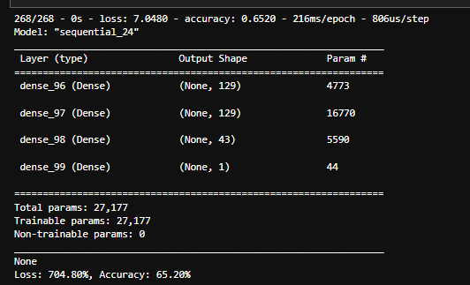

# Neural Network Model - Charity Analysis

## Project Overview

The purpose of this project is to use a neural network to predict whether a charity campaign was likely to be successful based on previous campaign data. 

## Results

### Data Preprocessing
- ***Target variables***: The target variable is the `IS_SUCCESSFUL` column, indicating whether or not the money was used effectively.
- ***Features***: The features were all the columns except the target column, and the ID columns (`EIN` and `NAME`)
- ***Removeable variables***: The variables that were removed were the `EIN` and `NAME` columns- since these columns are simply identifiers and do not contribute to whether the money was used effectively.

### Compiling, Training, and Evaluating the Model
#### ***Neurons, layers, and activation functions***
The parameters for the neural network model structure were initially chosen to match the output from the starter code- this seemed like a decent starting point for the model.

- input layer:
    - set to `len(X_train_scaled[0])` to match number of features in the model
- hidden layer 1:
    -  `units` = 80
    - activation = `relu`
- hidden layer 2:
    - `units` = 30
    - activation = `relu`
- output layer:
    - `units` = 1
    - activation = `sigmoid`
- loss = `binary_crossentropy`
- optimizer = `adam`
- epochs = 50

***Was target model performance achieved?*** 
The model accuracy was initially 72.58%, which is just short of the 75% cutoff. This indicated that some optimization would be needed to reach the goal accuracy. 

***First Model Accuracy*** 
 

***Steps taken to optimize model*** 
1. **Drop `INCOME_AMT` column** 
This column had a weird bin 'Jan-99' which seemed like an input error or something, so I thought it might be confusing the model, and decided to remove the entire column to see what happened. 

    

2. **Bin values in `ASK_AMT` column** 
The values in the `ASK_AMT` column had a wide distribution and high variance, with the lowest value being 5000, and the highest value being 8.5mil. I created bins using `pd.qcut` so they would be divided based on distribution, then added the bins as a column to the dataframe and dropped the original `ASK_AMT` column. This new binned column was then changed to an object datatype so it could be encoded with the rest of the categorical variables. 

    

3. **Model Structure Changes** 
There was a third hidden layer added to increase the complexity of the model. Additionally, each hidden layer had the units increased. Layers 1&2 were increased to be 3x than the input layer, and the third layer was set to have the same units as the input layer. The activation functions were kept the same (hidden layers = `relu`, output layer = `sigmoid`). 

    ***Structure***

      

4. **Increase number of epochs** 
The training code was updated to train over 250 epochs instead of 50. 

***Model Accuracy*** 

The accuracy with the above changes was 71.66%, so slightly diminished from the original model.  

5. **Change activation function** 
The trained model was called back to evaluate an updated model where the activation function on the first hidden layer was changed to `elu`. This change decreased performance down to 65.20%, and the loss increased significantly to 704%. 

    

## Summary

### Overall results
Overall, even with several changes I was unable to improve on the original model. In fact, it seemed that increasing the complexity of the model and further manipulating the starting data only worked to diminish the model's performance. So, the original version of this model with an accuracy of approximately 73% may be about as good as it gets for this type of model.  

### Recommendation for how a different model could solve this classification problem
It's  possible a Random Forest Classifier Model could work for this problem. The data is large, but not particularly complex, so a Random Forest Classifier model might be able to get similar results but much quicker and with much fewer optimizations. The neural network model may have overcomplicated the problem, so something simpler like a Random Forest could be a better fit for the data. 